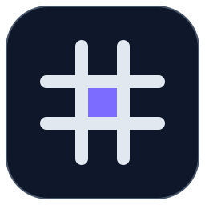

<p align="center">
  
</p>

<h1 align="center">Dash#</h1>

<p align="center">
  <b>A fast, self-hosted homelab dashboard</b> with drag-and-drop tiles and live widgets —<br>
  one small container, no database, nothing phoning home.
</p>

<p align="center">
  
  
  
  
</p>

---

> 🤖 **Built with Claude.** This project was designed and implemented with heavy help from
> [Claude](https://claude.com) (Anthropic's AI). I'm not a professional developer — I wanted a
> dashboard for my own homelab and used Claude as a pair-programmer to actually get it built.

## What is Dash#?

I run a small homelab and wanted one good-looking start page for it — a place to jump to my services
and see live status at a glance: system load, Docker containers, DNS filtering, media, network, storage.
I tried a few of the dashboards out there, and while they're solid projects, none of them quite gave me
the exact mix of integrations and workflow I was after. So I built Dash# to be the dashboard that fit
my setup — configurable entirely from the browser, one small container, nothing else to babysit.

Under the hood it's a plain **Node.js + Express** app that serves a static frontend and proxies every
integration **server-side**: the backend talks to your services with your stored credentials and returns
small, normalized JSON. So there's no CORS, your tokens never reach the browser, and there's no database
and no build step.

- 🧩 **Design mode** — freely place & resize tiles on a grid, add/hide them from a catalog, rename section headings, and spread widgets across multiple pages; the layout is saved server-side
- 🎛️ **Per-tile settings** — hover a tile, open ⋯ → Einstellungen: rename the tile, toggle its building blocks (rings, charts, summaries, posters, columns …) and cap list lengths; stored with the dashboard layout
- ⚡ **Live widgets** — System (via [Glances](https://nicolargo.github.io/glances/)), Docker, AdGuard Home, Plex, UniFi Network & Protect, Nextcloud, Unraid VMs, weather
- 🖥️ **Unraid VM control** — list VMs with live status, start/stop/pause/reboot right from the dashboard, and jump into the built-in VNC console
- ⚙️ **Configure in the browser** — everything under `/settings`, no config files to hand-edit
- 🔒 **Private by design** — no telemetry, no tracking; secrets stay in your mounted config volume
- 🐳 **One container** — `node:20-alpine`, multi-arch (amd64/arm64), healthcheck, ~48 MB

> [!NOTE]
> **Dash# is at v0.1 — the first public iteration.** It works and is used daily, but expect rough edges
> and breaking changes before 1.0. Feedback and issues are very welcome.

## Screenshot

_Coming soon._

## Quick start

```bash
docker run -d --name dashsharp \
  -p 8085:3000 \
  -v /path/to/appdata/dashsharp:/app/config \
  even512/dashsharp:latest
```

Open `http://<host>:8085`, then go to **⚙️ → Integrations** to connect your services. On first start a
default config is written into the mounted volume automatically.

Prefer Compose? See [`docker-compose.yml`](docker-compose.yml):

```bash
docker compose up -d
```

## Install on Unraid

1. Fetch the template on your Unraid box:
   ```bash
   wget -O /boot/config/plugins/dockerMan/templates-user/my-dashsharp.xml \
     https://raw.githubusercontent.com/even512/dashsharp/main/unraid/dashsharp.xml
   ```
2. **Docker → Add Container** → pick **Dash-Sharp** from the *Template* dropdown.
3. Check the WebUI port (`8085`) and appdata path (`/mnt/user/appdata/dashsharp`) → **Apply**.

## Configuration

Everything is configured from the web UI under **Settings → Integrations** and stored in
`config/secrets.json` **inside your mounted volume** — never baked into the image, never committed.

| Integration | Needs |
|---|---|
| System / Docker | Glances URL (`http://host:61208`) |
| AdGuard Home | URL, user, password |
| Plex | URL, X-Plex-Token |
| UniFi | Cloud API key (api.ui.com) |
| Nextcloud | URL, user, app password |
| Unraid VMs | Unraid URL + GraphQL API key |
| Weather | City (Open-Meteo, no key) |

### Unraid VMs

Manage your Unraid VMs from a dashboard tile: live status, one-click **start / stop / pause / resume /
reboot / force-stop**, and a **VNC** button that opens Unraid's built-in noVNC console in a new tab.

Uses the official [Unraid GraphQL API](https://docs.unraid.net/API/) (Unraid **7.2+**) for status and
control. Setup:

1. Enable the API and create a key on your Unraid box:
   ```bash
   unraid-api apikey --create
   ```
   (or generate one from the Unraid web UI). A read/VM-control scoped key is enough.
2. In **Settings → Unraid VMs**, enter your Unraid URL (e.g. `http://tower.local`) and the API key.

#### Direct VNC console (no Unraid login)

By default the VNC button opens Unraid's own VM manager, which sits behind the Unraid web login.
To jump **straight into the console** — embedded in the dashboard, with no login — add SSH access
in the same settings tab (host defaults to the Unraid URL, user defaults to `root`; password *or*
private key). Dash# then reads the VM's VNC port over SSH (`virsh dumpxml`), tunnels the connection,
and renders it with a bundled [noVNC](https://github.com/novnc/noVNC) — talking directly to the VM's
QEMU VNC port, bypassing Unraid's login entirely. The console modal also has **open-in-new-tab** and
**fullscreen** buttons.

> [!WARNING]
> This gives Dash# SSH access to your Unraid box — only enable it on a trusted LAN. If you serve
> Dash# over **HTTPS**, browsers block the plain `ws://` VNC connection (mixed content); run Dash#
> over HTTP on your LAN for the embedded console. Per-VM CPU/RAM graphs are not exposed by the
> GraphQL API and are therefore not shown.

#### Making the console feel smooth

VNC is inherently choppy for interactive desktops (it re-encodes the screen on the host), so the same
lag shows up in Unraid's own noVNC too. Options, from quick to best:

- **Tune noVNC** — the console toolbar has a **quality** selector (*Fluid / Balanced / Sharp*); *Fluid*
  sends less data and feels smoother. Dash# also requests a server-side resize to your window and
  disables Nagle on the socket to cut input latency.
- **Windows guests → RDP.** Windows VMs get an extra **RDP** button that downloads a ready-made `.rdp`
  file for the native client — dramatically smoother than VNC. The guest IP is found automatically over
  SSH (`virsh domifaddr`; install the VirtIO guest tools / QEMU guest agent), or set it per-VM under
  **Settings → Unraid VMs → VMs & RDP**. Enable Remote Desktop inside Windows first. The Windows type is
  auto-detected from the Unraid VM template and can be overridden there.
- **Linux guests** — switch the VM's graphics from QXL to **VirtIO (3D / VirGL)** and install the guest
  drivers; give it more video RAM.
- **Near-native (gaming / GPU)** — run **Sunshine** in the VM and connect with **Moonlight** for
  hardware-encoded H.264/HEVC streaming, ideal with GPU passthrough.

Any value can also be set as an environment variable (see [`.env.example`](.env.example)); env vars take
precedence over the UI values.

> **Docker tile shows only running containers?** That's controlled by Glances itself, not Dash#.
> Set `all = True` under `[containers]` (or the legacy `[docker]` section) in `glances.conf` on
> your Glances host and restart Glances to include stopped/exited containers too.

> **System panel shows a container ID instead of your hostname?** This happens when the Glances
> container isn't run with `--uts=host`, so it reports its own Docker-assigned hostname. Fix it at
> the source (`--uts=host`), or set a fixed override under **Settings → Glances → Hostname**.

## Data & persistence

All mutable state lives in the mounted `/app/config` volume:

```
config/
├── services.yaml
├── secrets.json
├── dashboard-layout.json
├── quicklinks.json
├── disks.json
└── status.json
```

`services.yaml` holds title, search and quicklinks and is auto-created on first run. `secrets.json`
holds your API keys/tokens, set via the UI. The rest track dashboard state: tile order and visibility,
quick-access tiles, custom disk names, and health-check URLs.

Back up that folder and you've backed up everything. Image updates never touch it.

## Updating

- **Unraid:** Docker tab → *Check for Updates* → apply. Your config is preserved.
- **Compose:** `docker compose pull && docker compose up -d`.

## How it works

Dash# is a single Node/Express process. It serves the static frontend from `public/` and exposes a set
of same-origin `/api/*` endpoints the browser calls. Each integration is a **server-side proxy**: the
backend contacts Glances/AdGuard/Plex/etc. with your stored credentials and returns a trimmed JSON — no
CORS, no tokens in the browser. State is a handful of JSON/YAML files in the config volume; there is no
database and no build step.

## Security

The dashboard has **no built-in authentication** — anyone who can reach the port can use it. Keep it on
your LAN, or put it behind a VPN or an authenticated reverse proxy. **Do not** expose port 8085 directly
to the internet.

## Build from source

```bash
git clone https://github.com/even512/dashsharp.git
cd dashsharp
cp .env.example .env
npm install
npm run dev
```

`npm run dev` starts the app at `http://localhost:3000`. The `.env` copy is optional.

Build the image yourself: `docker build -t dashsharp .`

Regenerate the logo/icons after editing [`logo.svg`](logo.svg):

```bash
npm i -D sharp && node scripts/render-icon.mjs
```

## Contributing

This started as a personal project, so it's still a bit rough around the edges — but issues and PRs are
very welcome. Small, focused improvements are the easiest for me to review and land.

## License

No license chosen yet (default copyright applies). An OSI license such as MIT may be added later.
